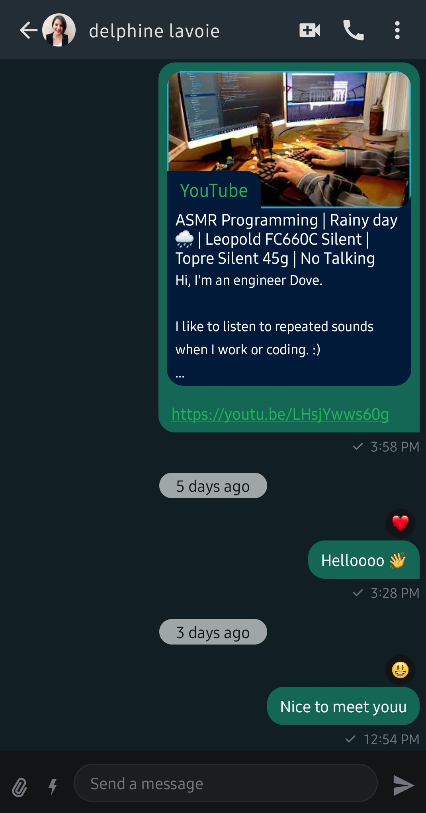

This is a [WhatsApp](https://www.whatsapp.com/) clone app built with Jetpack Compose and [Stream Chat SDK for Compose] 

## 📷 Previews

 

# License
Licensed under the Apache License, Version 2.0 (the "License");
you may not use this file except in compliance with the License.
You may obtain a copy of the License at

   http://www.apache.org/licenses/LICENSE-2.0

 Thanks: GetStream.io

